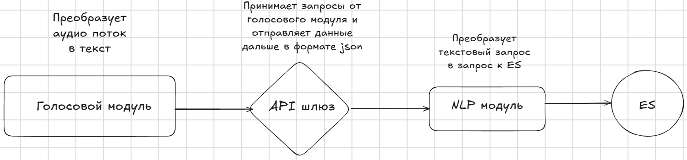

# Техническое задание: Голосовой Ассистент для Поиска Информации о Фильмах

## Цель проекта:
Реализовать систему, которая интегрирует голосового помощника 
(Алиса / Маруся / Siri) с сервисом поиска фильмов, 
построенным на Elasticsearch (далее — ES), 
для голосового получения информации о фильмах.

## Функциональные требования
### Поддерживаемые сценарии запросов
* Базовые:
  * Автор фильма: «Алиса, кто автор фильма {название}?» 
  * Количество фильмов автора: «Маруся, сколько фильмов выпустил автор {имя}?»
  * Длительность фильма: «Сири, сколько длится фильм {название}?»
* Дополнительные сценарии:
  * Рейтинг фильма: «Какой рейтинг у фильма {название}?»
  * Жанр фильма: «К какому жанру относится фильм {название}?»
  * Дата выхода: «Когда вышел фильм {название}?»
  * Фильмы по году: «Назови фильмы {год} года»
  * Актеры фильма: «Кто играет в фильме {название}?»

### Логика обработки:
* При получении запроса система определяет:
  * Тип запроса (автор, количество, длительность и т.д.). 
  * Ключевые параметры (название фильма, имя автора, год).
* Формирует запрос к Elasticsearch (ES) в соответствии с шаблоном. 
* Если ES возвращает несколько результатов, система использует первый вариант. 
* Ответ преобразуется в текстовую форму и озвучивается помощником.

### Обработка ошибок:
* Если данные не найдены: «Информация по запросу не найдена». 
* При нераспознанном запросе: «Уточните, пожалуйста, вопрос».

## Технические компоненты
### Общая архитектура


### Описание компонентов:
* API-шлюз:
  * Принимает запросы от голосовых помощников (HTTP/Webhook). 
  * Формат запроса: JSON с полями platform (алиса/маруся/siri), query (текст запроса).
* NLP-обработчик:
  * Анализирует запрос с помощью регулярных выражений:
```
patterns = {
    "author": r"кто автор фильма (.+)\??",
    "count_movies": r"сколько фильмов выпустил автор (.+)\??",
    "duration": r"сколько длится фильм (.+)\??",
    "rating": r"какой рейтинг у фильма (.+)\??",
    "genre": r"к какому жанру относится фильм (.+)\??"
}
```
  * Извлекает сущности (названия, имена) из запроса.

* Elasticsearch-интерфейс:
  * Генерирует ES-запросы на основе типа запроса. Пример для поиска автора:
```
{
  "query": {
    "match": {
      "title": "{название_фильма}"
    }
  },
  "_source": ["director"]
}
```
* Поля в индексе ES: title, director, duration, rating, year, actors.

### Формат ответа:
```
{
  "response": {
    "text": "Фильм 'Интерстеллар' длится 169 минут",
    "tts": "Фильм Интерстеллар длится 1 час 49 минут."
  }
}
```

### Ограничения
* Поддерживаются только русскоязычные запросы. 
* Глубина поиска ES: первые 10 результатов, из которых берется топ-1.

